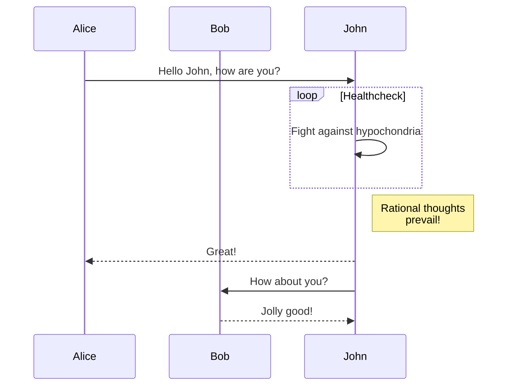

## Usage



## Configuration

Configure for all home and regular pages:

```toml
[params.mermaid]
  enable = true
```

Configure for a single post in the front matter (**Params in front matter have higher precedence**):

```yaml
mermaid: 
  enable: true
```

## mermaid syntax

why not go to [its official site](https://mermaid-js.github.io) to have a look?
